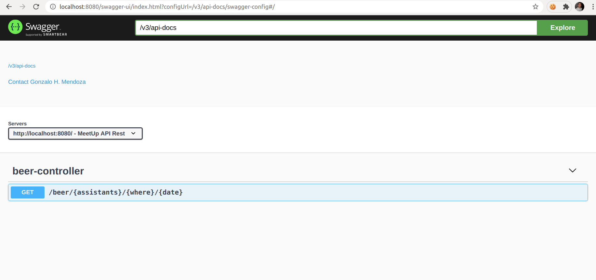

# Santander Tecnologia Challenge
En Santander Tecnología queremos armar las mejores meetups y para eso planteamos hacer una app que nos ayude a lograr que no falte lo fundamental...¡Birras!

## ¿Cual es el problema?
Tenemos un proveedor que nos vende cajas de 6 unidades de birras. El problema es que: 
- Si hace entre 20° y 24° Celcius, se toma una birra por persona
- Si hace menos de 20° Celcius, se toma 0.75
- Si hace mucho calor (más de 24° Celcius), se toman 2 birras mas por persona
Y siempre preferimos que sobre y no que falte.

## Este es nuestro backlog, ¿desarrollamos? 

Cada historia de usuario tiene su parte front y back, las dos primeras son obligatorias y cuantas más hagas, ¡mejor!
- Como admin quiero saber cuántas cajas de birras tengo que comprar para poder aprovisionar la meetup.
- Como admin y usuario quiero conocer la temperatura del día de la meetup para saber si va a hacer calor o no
- Como usuario y como admin quiero poder recibir notificaciones para estar al tanto de las meetups
- Como admin quiero armar una meetup para poder invitar otras personas
- Como usuario quiero inscribirme en una meetup para poder asistir
- Como usuario quiero hacer check-in en una meetup para poder avisar que estuve ahí.
 
## Tené en cuenta estos aspéctos técnicos

- Uso de swagger para las APIs
- Cache retry, circuit breaker, maturity level, I18N, reactive
- Seguridad
- Front responsive/pwa
- Tests ui
- Testing automático

## Consideraciones finales

Según qué tipo de dev te consideres, podes hacer front, ack o ambas versiones de la historia de usuario, es a gusto y piaccere.
Para backend te proponemos usar java, kotlin, .Net, JS o Golang. Y para la persistencia, sentite a gusto de elegir la bd que te guste. Para front web, podes usar Angular, React o Vue. Para fron mobile podes usar IOS o Android.

Si consideras tener supuestos, como "estaAPImevaadevolverxcosa", por favor aclaralo en el README o mejor, podes mockearlo. 
Por favor agregá un README que tenga info del stack, cómo hacer un deploy o info que aporte valor.
¡Lo último!

Bonus points:
- Proponer esquema de CI/CD
- Proponer un esquema de automatización de pruebas

Te dejamos un par de APIs de clima para que uses la que mas te convenga:

https://rapidapi.com/community/api/open-weather-map

https://rapidapi.com/weatherbit/api/weather

https://rapidapi.com/stefan.skilarov/api/AccuWeather

https://rapidapi.com/darskyapis/api/dark-sky

# Propuesta

Desarrollo de un ecosistema de microservicios ubicados para resolver el problema separadamente.

##  Stack
1. Java 11
2. Docker & Docker Compose
3. Make
4. Golang

## Comandos
1. Ejecutar la aplicación (linkeada via Docker)
```bash
make run
```
2. Parar la aplicación (y sus miscelaneos)
```bash
make stop
```
3. Formatear uando Google Formater
```bash
make format
```

4. Ejecutar tests unitarios
```bash
make unitTest
```

5. Ejecutar tests de ḿutación
```bash
make mutationTest
```

## Contexto
```bash
http://localhost:8080
```


## Swagger
```bash
http://localhost:8080/swagger-ui.html
```
